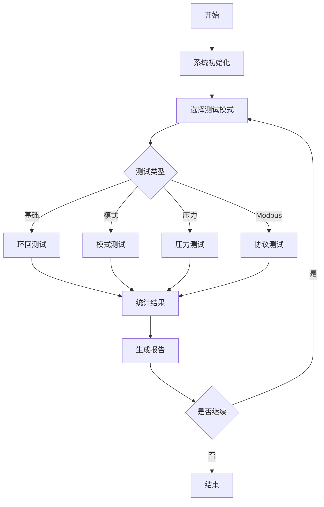

# STM32F103C8 串口测试指南

## 📋 概述

本测试系统为STM32F103C8智能照明控制系统提供全面的串口通信测试功能，包括：

- **基础串口功能测试**：环回测试、模式测试、压力测试
- **Modbus RTU协议测试**：从站功能、响应时间、继电器控制
- **性能分析**：统计分析、响应时间测量、成功率计算

## 🚀 快速开始

### 1. 硬件准备

| 接口 | 引脚 | 功能 | 说明 |
|------|------|------|------|
| USART1 | PA9/PA10 | 测试串口 | 用于Modbus通信测试 |
| USART2 | PA2/PA3 | 调试串口 | 用于控制和监控 |
| RS485-1 | PA4 | 使能控制 | USART2的RS485控制 |
| RS485-2 | PA8 | 使能控制 | USART1的RS485控制 |

### 2. 软件编译

#### 方式一：使用测试专用主程序

```bash
1. 备份原main.c文件
2. 将main_uart_test.c重命名为main.c
3. 在Keil中重新编译项目
4. 下载到目标板
```

#### 方式二：集成到现有项目

```c
// 在main.c中包含测试模块
#include "uart_test.h"

// 在主循环前初始化
UartTestConfig_t config = {
    .huart = &huart1,
    .baudRate = 9600,
    .timeout = 1000,
    .mode = TEST_MODE_LOOPBACK,
    .useRS485 = true,
    .rs485Port = GPIOA,
    .rs485Pin = GPIO_PIN_8
};
uartTestInit(&config);
```

### 3. 连接测试

1. **环回测试连接**：
   - 将PA9(TX)和PA10(RX)短接（或通过RS485转换器环回）
   
2. **Modbus测试连接**：
   - 连接Modbus主站设备（如ModbusPoll软件）
   - 设置：9600,8,N,1，从站地址01

3. **调试串口连接**：
   - PA2/PA3连接USB转串口
   - 串口工具设置：115200,8,N,1

## 📊 测试功能详解

### 基础功能测试

#### 1. 环回测试

测试串口收发基本功能，验证硬件连接。

```c
// API调用示例
uint8_t data[] = "Test Data";
TestResult_e result = uartTestLoopback(data, sizeof(data), 1000);
```

**测试指标**：
- ✅ 数据完整性
- ✅ 响应时间
- ✅ CRC校验（如有）

#### 2. 模式测试

发送特定模式数据，验证数据传输准确性。

支持模式：
- `0x55/0xAA`：交替模式
- `0xFF`：全高电平
- `0x00`：全低电平
- 递增序列

```c
// 测试0x55模式，64字节，重复10次
TestResult_e result = uartTestPattern(0x55, 64, 10);
```

#### 3. 压力测试

持续发送不同大小的数据包，测试稳定性。

```c
// 10-256字节随机包，持续10秒
TestResult_e result = uartTestStress(10, 256, 10);
```

**测试参数**：
- 最小包大小：10字节
- 最大包大小：256字节
- 测试时长：可配置

### Modbus RTU测试

#### 1. 功能码测试

| 功能码 | 功能 | 测试内容 |
|--------|------|----------|
| 0x03 | 读保持寄存器 | 读取多个寄存器值 |
| 0x04 | 读输入寄存器 | 读取只读寄存器 |
| 0x06 | 写单个寄存器 | 修改单个寄存器 |
| 0x10 | 写多个寄存器 | 批量修改寄存器 |

#### 2. 继电器控制测试

通过Modbus控制5路继电器：

```c
// 控制继电器（bit0-4对应继电器1-5）
TestResult_e result = modbusTestRelayControl(0x01, 0x15); // 开启1,3,5
```

#### 3. 响应时间测试

```c
// 测试20次，返回平均响应时间（微秒）
uint32_t avgTime = modbusTestResponseTime(0x01, 20);
```

## 🎮 交互式测试

### 串口命令

通过调试串口（USART2）发送以下命令：

| 命令 | 功能 |
|------|------|
| `1` | 执行基础环回测试 |
| `2` | 执行模式测试 |
| `3` | 执行10秒压力测试 |
| `4` | 执行Modbus功能测试 |
| `5` | 执行完整测试套件 |
| `r` | 显示测试报告 |
| `c` | 清除统计数据 |
| `m` | 显示菜单 |
| `s` | 停止连续测试 |

### LED指示

使用继电器作为测试状态指示：

| 继电器 | 状态 | 含义 |
|--------|------|------|
| 1 | 慢闪 | 系统运行中 |
| 2 | 常亮 | 测试待机 |
| 3 | 快闪 | 测试通过 |
| 4 | 快闪 | 测试失败 |
| 5 | 闪烁 | 数据统计（每10包） |

## 📈 测试报告

### 统计信息

```
========== UART测试报告 ==========
总数据包: 1000
成功: 998 | 错误: 2 | 超时: 0
成功率: 99.80%
总字节数: 64000
响应时间(us) - 平均: 1250 | 最小: 980 | 最大: 2100
===================================
```

### 性能指标

| 指标 | 良好 | 一般 | 差 |
|------|------|------|-----|
| 成功率 | >95% | 80-95% | <80% |
| 响应时间 | <5ms | 5-20ms | >20ms |
| CRC错误 | <1% | 1-5% | >5% |

## 🔧 故障排查

### 常见问题

1. **环回测试失败**
   - 检查TX/RX连接
   - 验证波特率设置
   - 确认RS485方向控制

2. **Modbus无响应**
   - 检查从站地址
   - 验证CRC计算
   - 确认帧间隔时间

3. **压力测试错误多**
   - 降低波特率
   - 增加测试间隔
   - 检查电源稳定性

### 调试技巧

1. **使用逻辑分析仪**
   - 捕获UART波形
   - 分析RS485切换时序
   - 验证数据完整性

2. **分步测试**
   - 先测试简单环回
   - 再测试Modbus协议
   - 最后进行压力测试

3. **日志分析**
   - 启用详细日志
   - 记录错误帧
   - 分析失败模式

## 🎯 测试用例

### 用例1：基础通信验证

**目的**：验证UART硬件功能正常

**步骤**：
1. 短接TX/RX
2. 发送命令'1'
3. 观察返回结果

**预期**：测试通过，继电器3闪烁

### 用例2：Modbus从站验证

**目的**：验证Modbus RTU协议实现

**步骤**：
1. 连接ModbusPoll软件
2. 设置从站地址01
3. 读取保持寄存器0-2

**预期**：返回0x1234, 0x5678, 0xABCD

### 用例3：长时间稳定性测试

**目的**：验证系统长期稳定性

**步骤**：
1. 发送命令'3'
2. 运行10秒压力测试
3. 查看统计报告

**预期**：成功率>90%，无内存泄漏

## 📝 API参考

### 初始化函数

```c
HAL_StatusTypeDef uartTestInit(UartTestConfig_t* config);
```

### 测试函数

```c
// 基础测试
TestResult_e uartTestLoopback(uint8_t* data, uint16_t length, uint32_t timeout);
TestResult_e uartTestPattern(uint8_t pattern, uint16_t length, uint16_t iterations);
TestResult_e uartTestStress(uint16_t minSize, uint16_t maxSize, uint32_t duration);

// Modbus测试
HAL_StatusTypeDef modbusTestSlaveInit(uint8_t slaveAddr);
TestResult_e modbusTestRelayControl(uint8_t slaveAddr, uint8_t relayMask);
uint32_t modbusTestResponseTime(uint8_t slaveAddr, uint16_t iterations);
```

### 辅助函数

```c
UartTestStats_t* uartTestGetStats(void);
void uartTestResetStats(void);
void uartTestPrintReport(UART_HandleTypeDef* huart);
```

## 🚦 测试流程图



## 📌 注意事项

1. **硬件要求**
   - 确保电源稳定（3.3V）
   - RS485终端电阻120Ω
   - 良好的地线连接

2. **软件配置**
   - DMA缓冲区大小≥512字节
   - IDLE中断必须启用
   - 看门狗超时>测试周期

3. **测试环境**
   - 避免强电磁干扰
   - 保持适当的通信距离
   - 使用屏蔽双绞线

## 🔄 版本历史

| 版本 | 日期 | 更新内容 |
|------|------|----------|
| v2.0.0 | 2025-01-20 | 完整测试系统实现 |
| v1.0.0 | 2025-01-19 | 基础环回测试 |

## 📧 技术支持

如有问题，请联系：
- 项目组：Lighting Ultra Team
- 邮箱：support@lightingultra.com

---
*本文档最后更新：2025年1月20日*
